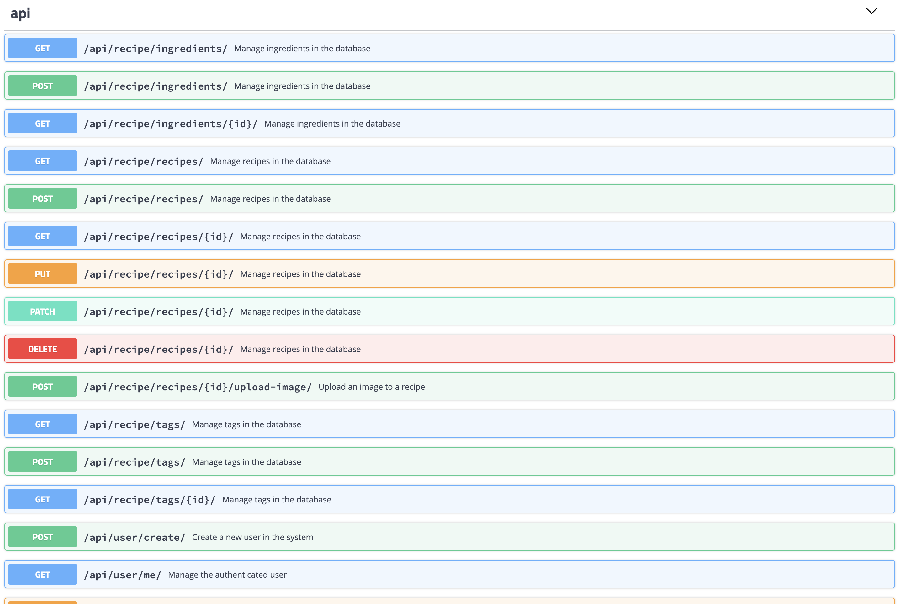

# Project description

This is an extended Recipe API.  
It allows to register new users, authenticate them using token generation, 
retrieve or update user details.  
User can operate tags, ingredients, recipes, images.  
All these components allow creating a comprehensive front-end for the API. 
This can be a recipe website or mobile application.   

## Technical details

Website is built on the _Django 2.2_ and _Django REST Framework_.  
The database is _Postgres_.  
The application uses _Docker_ and _Travis-CI_ for automatic unit testing after each commit.  

Project is covered with unit tests. For local API testing, I use _Postman_.  
Also, the project is configured with Swagger.

## Endpoints

## User

Default Django User model is customized to the user can log in using `email` and `password` 
instead of `username` and `password`. That is mirrored in admin panel as well.

## Filtering

Tags, ingredients, and recipes can be filtered using GET query params.

# Upwork

This project is part of my Upwork portfolio.
Please check my [Upwork profile](https://www.upwork.com/o/profiles/users/_~010104bbdffc992d66/?s=1110580748673863680) in order to reach to other projects.

Btw, I'm available for freelance work! 
